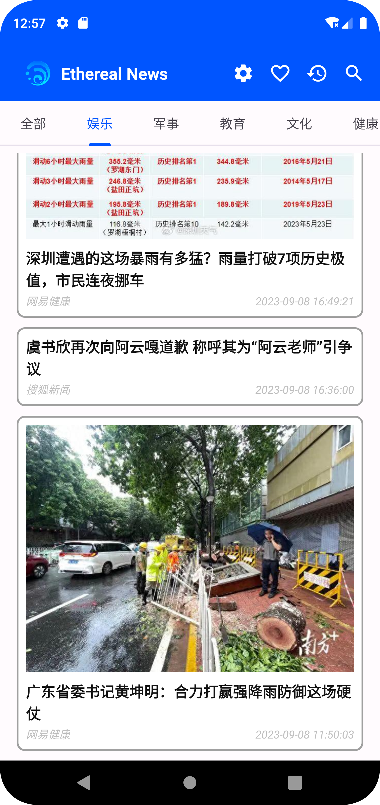
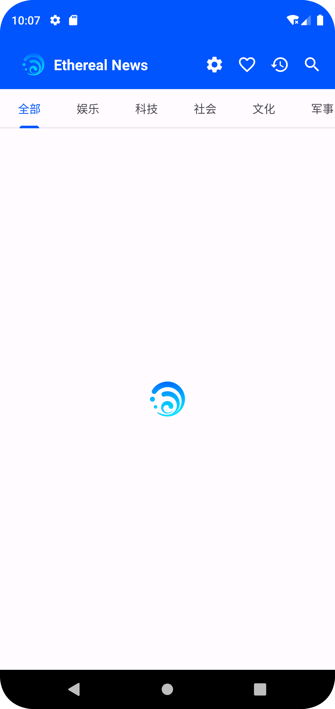
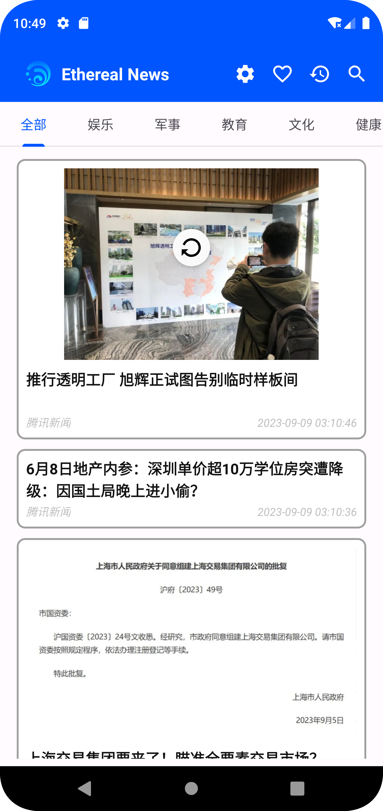
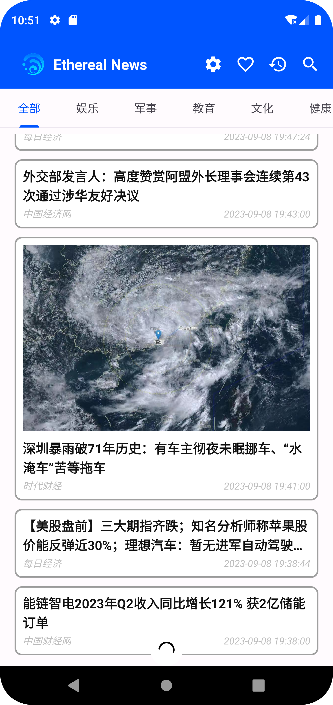
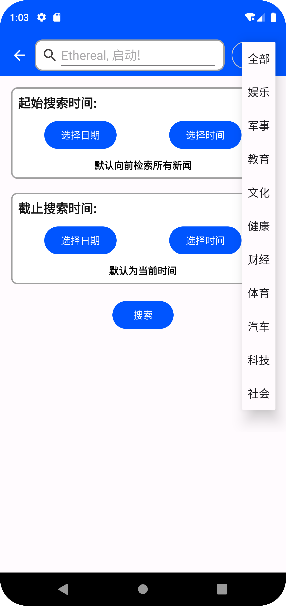
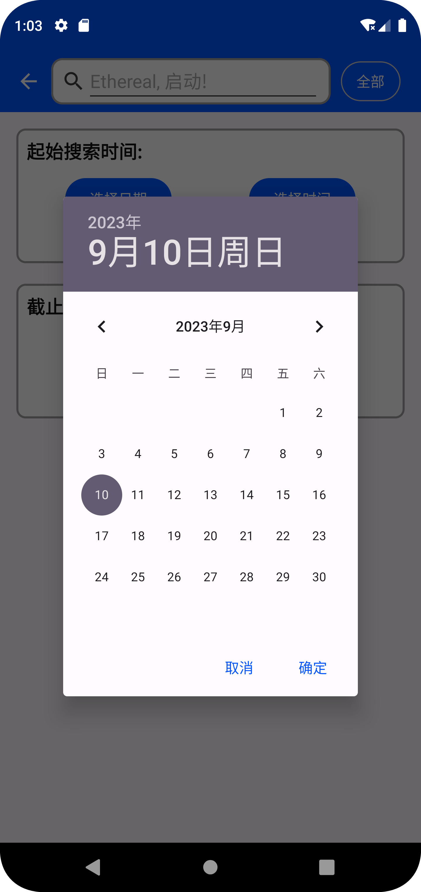
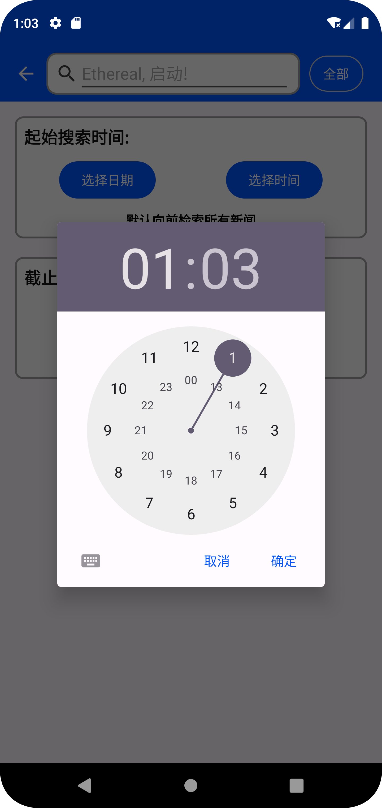
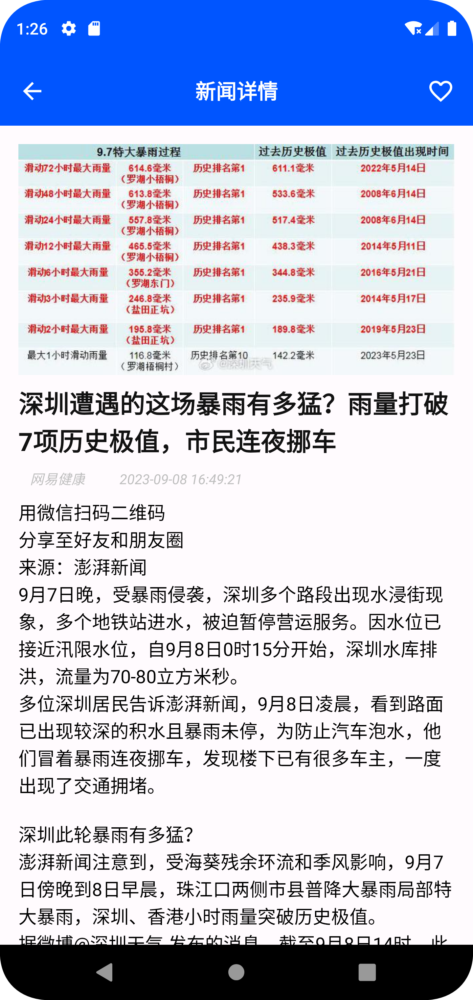
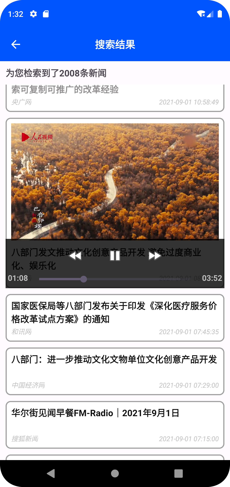

# Ethereal News 项目报告

  程思翔 计13班

[toc]

##    代码结构

​	在项目根目录下, 主要代码被组织为:

### `app.src.main`

​	包含应用程序的主要代码、资源文件、清单文件等.

+ `java.com.java.chengsixiang`: 包含应用程序的主要代码.
    + `Activity`: 用于实现 **Ethereal News** 用户界面的可视部分, 负责呈现界面、处理输入、进行交互并切换不同的界面.
    + `Adapter`: 接收数据集并将其格式化绑定到 **RecyclerView** 用户界面, 根据数据的内容和位置来创建和更新页面.
    + `Utils`: 存储通用且与项目逻辑无关的功能方法, 包括日期处理、网络请求、图像加载.
+ `res`：存放资源文件, 包括 XML 布局、字符串、图像等.
+ `AndroidManifest.xml`：应用程序清单文件, 定义配置信息和组件.

### `build.gradle` & `settings.gradle`

​	配置项目和子模块的构建和依赖.

### `.git`

​	版本控制管理, 涵盖了项目的历史提交更改信息.

## 具体实现

​	将从功能点的视角详细介绍项目结构, 即每个功能点分别对应于哪些代码.

### 系统支持 (10’)

​	程序在本机上正常运行, 程序不崩溃, 运行流畅.

	

### 新闻列表 (30’)

#### 展示新闻列表, 进入详情页面 (10’)

+ `Activity/HomePage.java`

    使用 **TabLayout** 与 **ViewPager** 实现多 **tab** 切换不同类别新闻页.

    

    	
    

+ `Activity/NewsFragment.java`

    定义了展示某一特定类别新闻的 **Fragment**.

+ `Activity/NewsDetail.java`

    定义了新闻详情页布局, 包括新闻内容的展示.

+ `Adapter/PagerAdapter.java`

    管理 **ViewPager** 与 **Fragment** 的对应关系, 允许滑动或点击标签以切换不同的 **Fragment**.

+ `Adapter/NewsAdapter.java`

    将 **NewsItem** 加载绑定到 **Fragment** 中, 并为每个 **NewsItem** 绑定了一个 **OnClickListener**, 通过点击可进入新闻详情页.

+ `Utils/NewsItem.java`

    定义新闻类, 记录一条新闻的所有元信息, 使用 **newsID** 作为唯一性约束.

+ `Utils/QueryHelper.java`

    使用 **okhttp3** 库异步处理网络请求. 注意到新闻接口给出的 **page** 参数在使用过程中, 如果 **page * pageSize** 大于 **10000**, 接口会返回报错. 因此对于加载更多新闻的逻辑, 我选择另一种处理方式.

    记录当前返回的新闻列表中最后一项新闻的发布时间, 将其倒退一秒并传入 **endDate**, 构造新 **url** 获取更多新闻.

+ `Utils/NewsGlide.java`

    使用 **glide** 库处理图片 **url** 加载, 对于不存在 **url** 的情况或者加载失败的 **url**, 会将 **ImageView** 设置为 **gone** 属性而不可见.

#### 上拉加载, 下拉刷新 (10’)

+ `Activity/NewsFragment.java`

    使用 **SwiprRefreshLayout** 包裹 **RecyclerView** 实现下拉刷新, 使用 **setOnRefreshListener** 监听下拉事件, 下拉到一定程度时通过 **api** 重新刷新当前类别新闻. 该组件自带有加载动画.

    同时为 **RecyclerView** 继承实现 **OnScrollListener** 监听滑动事件, 当滑动到底部时, 使用 **ProgressBar** 视图来展示加载动画, 并重写 **onLoadMore** 函数通过调用 **api** 加载更多新闻. 不止上拉刷新与下拉加载的动画, 我还为新闻列表的初始化提供了简易的加载界面.

    在展示图片的过程中, 一开始设置 **ImageView** 属性为 **centerCrop**, 并固定其高度, 但如此处理方式不能适配不同比例的图片; 我随后设置 **ImageView** 属性为 **fitCenter**, 动态匹配图片高度, 实现更美观的加载.

    

    	
      
      
    

+ `Utils/ScrollListener.java`

    展示了为 **RecyclerView** 监听滑动事件并加载更多新闻的实现逻辑.

#### 搜索新闻, 展示搜索 (10’)

+ `Activity/SearchPage.java`

    使用 **Calendar** 类提供时间表盘, 保证精细到秒记录搜索时间, 其中起始时间默认设置为 **1980.01.01**, 截止时间默认设置为当前时间; 使用 **Spinner** 提供新闻类别选项, 并将获取的参数传入搜索 **api** 进行新闻获取.

    

    	
      
      
    

+ `Activity/SearchResult.java`

    展示了搜索结果数, 并为 **RecyclerView** 继承实现 **OnScrollListener** 监听滑动事件, 当滑动到底部时, 使用 **ProgressBar** 展示加载动画, 并通过 **api** 加载更多新闻.
    
    

    	
    

### 列表分类 (10’)

+ `Activity/CategorySetting.java`

    使用 **RecyclerView** 记录已选以及可用分类, 使用不同 XML 布局展示其样式. 通过点击加号添加分类, 通过左滑或右滑删除已选分类. 将设置完成的分类保存到 **SharedPreference** 内, 允许 **ViewPager** 加载并展示在主页面内. 

    通过 **onActivityResult** 设置特定 **requestCode** 与 **resultCode**, 允许从 **CategorySetting** 返回 **HomePage** 即刻更新主页新闻 **tab**, 无需手动刷新.

    

    	
    

+ `Utils/CategoryHelper.java`

    继承 **ItemTouchHelper.Callback** 为 **RecyclerView** 提供拖拽和滑动的手势支持, 允许通过拖动或滑动排列项目. 定义接口 **CategoryHelperAdapter**, 通过 **onItemMove** 与 **onItemMove** 函数处理 **Item** 的拖动与左右滑动.

### 新闻详情 (15’)

#### 显示新闻来源和时间 (10’)

+ `Activity/NewsDetail.java`

    定义了新闻详情页布局, 将新闻获取接口中返回的 **publishTime** 与 **publisher** 直接展示在详情页.
    
    

    	
    

#### 正确播放视频 (5’)

+ `Activity/NewsDetail.java`

    定义了新闻详情页布局, 使用 **MediaController** 类加载视频 **url** 并播放.
    
    

    	
      
    

### 本地记录 (20’)

#### 存储已读新闻, 离线状况正常访问 (10’)

​	使用接口获得新闻列表时, 已将新闻列表信息内容存储在本地 **RecyclerView** 中, 因此已读的新闻在离线状态下均可正常访问. 

​	每条新闻在绑定到容器位置时会通过 **newsID** 检索是否存在于 **history** 数据表中, 并相应设置新闻标题颜色.进入新闻详情页时, 会将新闻加入历史记录同时变更标题栏颜色, 这样从详情页返回时即可观察到标题颜色的改变.

	

#### 存储历史及收藏记录, 展示新闻列表 (10’)

+ `Activity/HistoryRecord.java`

    展示历史记录列表, 按照阅读时间顺序排列, 下拉可以加载更多历史数据.

    

    	
    

+ `Activity/FavoriteNews.java`

    展示收藏记录列表, 按照收藏时间顺序排列, 下拉可以加载更多收藏数据. 收藏以及取消收藏时会通过 **Toast** 生成相关通知.

    

    	
      
    

+ `Utils/DatabaseHelper.java`

    使用 **SQLite** 数据库来处理本地数据存储, 按 **newsID** 为唯一约束分别建立 **history** 与 **favorite** 数据表, 实现了 **insertRecord**、**deleteRecord**、**getRecord** 方法处理数据.

+ `Utils/DatabaseManager.java`

    创建一个单例类来管理数据库实例, 确保在应用的生命周期内只有一个数据库, 并在生命周期内重复使用.

## 总结心得

+ **总结**

    我使用小学期第二周的时间完成了大部分开发工作, 后期进行 **UI** 调整及功能点优化. 短时间内接触一门全新的编程语言并进行开发本身就是一项挑战. 在开发初期, 由于知识与经验的匮乏, 我的进度较慢. 因此我选取了一些小型经典 **Android** 项目代码进行阅读, 并查阅 **Java** 官方文档, 了解项目结构与开发技巧后, 随后按功能点逐步进行开发, 过程较为顺利, 在预期时间内完成了任务.

+ **建议**

    仅靠课上的讲解进行开发对于初学者或许较有难度, 推荐给出一些示例工程或代码填空作业帮助同学进行辅助理解, 让大作业完成更为顺利.